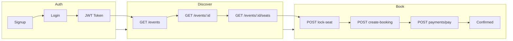
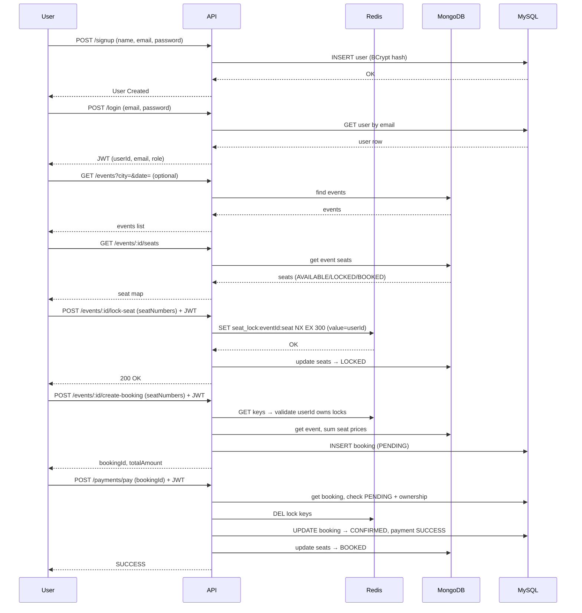
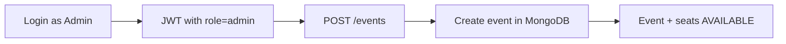
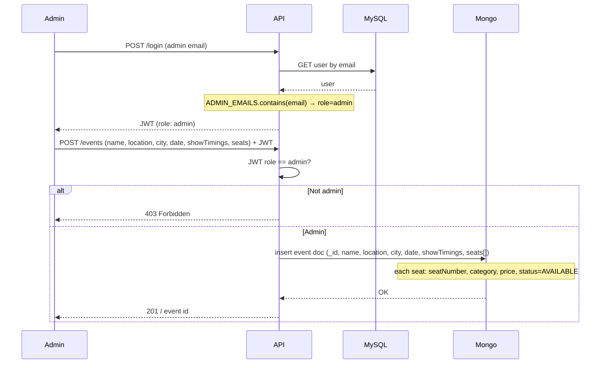
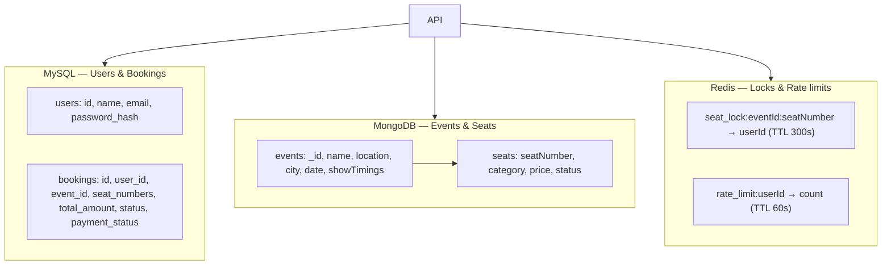
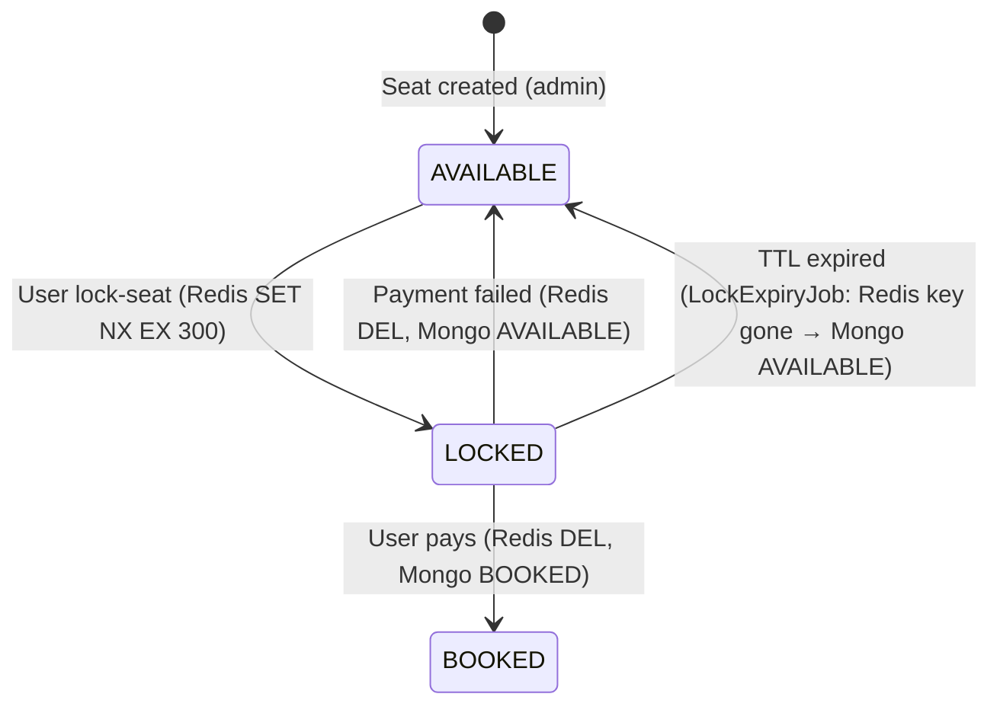
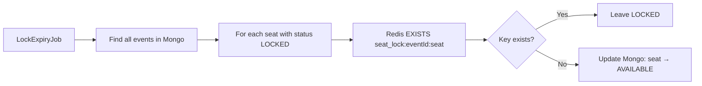
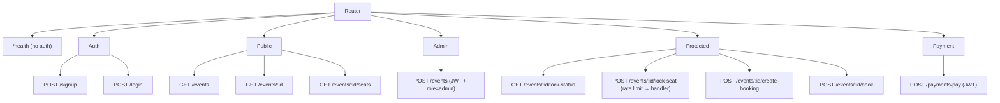
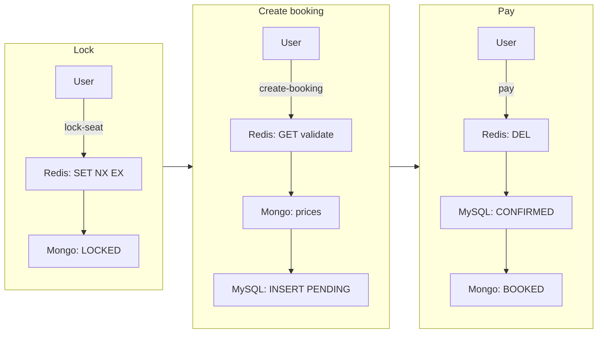

# Event Ticketing System — Flow Diagrams

High-level flows for **users**, **admins**, and **data stores** (MySQL, MongoDB, Redis).

---

## 1. User flow (end-to-end)

From signup to confirmed booking and payment.

**Detailed user journey:**

---

## 2. Admin flow

Admin-only: create events with seats and show timings.

**Admin create-event sequence:**

---

## 3. Database usage (which store does what)

**Per-operation store usage:**

| Operation            | MySQL        | MongoDB           | Redis                    |
|----------------------|-------------|-------------------|--------------------------|
| Signup               | INSERT user | —                 | —                        |
| Login                | SELECT user | —                 | —                        |
| Get events / seats   | —           | find events       | —                        |
| Lock seat            | —           | update LOCKED      | SET NX EX 300, rate incr |
| Create booking       | INSERT booking (PENDING) | find event (prices) | GET (validate locks) |
| Pay (success)        | UPDATE CONFIRMED | update BOOKED   | DEL lock keys            |
| Pay (failure)        | UPDATE FAILED | update AVAILABLE | DEL lock keys            |
| Lock expiry job      | —           | LOCKED → AVAILABLE when key missing | EXISTS check |
| Lock status (UI)     | —           | —                 | KEYS, GET, TTL           |
| Admin create event   | —           | insert event doc  | —                        |

---

## 4. Lock lifecycle (Redis + MongoDB sync)

How seat locks are created, used, and cleaned up.

**Lock expiry job (every 60s):**

---

## 5. Request routing (API entry points)

---

## 6. Cross-store booking flow (summary)

Diagram showing which store is touched at each step.

---